# POP QUIZ!
Pop! is a quiz for anyone who wants to try their knowledge in pop music. How well do you know an artist's discography or what year they released a specific song? This pop quiz will let you know.

## User Stories
* Create a username
* Scoretracking system
* Get feedback about the result after the quiz is done
* Relevent Social Media Icons

## UX
The quiz's theme is to simulate the pop trends of the late '90s and the early '00s, with a mix of bright colors and white.  When visiting the website, the user should get the happy, excited, and hopeful feelings pop music usually gives the listener.

### Color Scheme
The primary colors used for the website are:
* Purple for Background hex: #DCABFF
* Blue for Background hex: #8299FA 
* Turquoise for Background hex: #5FFDF5
* Orange for hover over Button hex: #DA4500
* Blue for Buttons hex: #350EA0
* Black and white for text and icons

To get the proper background color gradient, I used the [ColorSpace](https://mycolor.space/gradient3?ori=to+right+top&hex=%23DCABFF&hex2=%238299FA&hex3=%235FFDF5&submit=submit) 3-color-gradient generator. The color to get this background are the purple and blue listed above. 

The orange(#DA4500) and the blue(#350EA0) colors used are to style the buttons on the website. When a user hovers over a button, it changes the color to orange. By doing so, the user gets an indication if they are near a button.
* button  
* button with hover effect 

### Typography (explain any fonts and icon libraries used, font-awesome/google fonts, etc)
The font and icon styles have a digital-futuristic and smooth characteristic feel to them.
* The font style for the website is from Google Fonts. 
    * Heading elements have the font style: [Audiowide](https://fonts.google.com/specimen/Audiowide?query=Audio).
    * The remaining text elements have the font style: [Orbitron](https://fonts.google.com/specimen/Orbitron?query=orbitr).

* The icons in the footer and the header are from Font Awsome
    * [Disc](https://fontawesome.com/v5.15/icons/compact-disc?style=solid) icon in the header
    * [Spotify](https://fontawesome.com/v5.15/icons/spotify?style=brands) icon in the footer
    * [Instagram](https://fontawesome.com/v5.15/icons/instagram?style=brands) icon in the footer 

### Wireframes
#### Wireframe of the landingpage

#### Wireframe of the quiz game structure 

#### Wireframe of the result structure

## Features
### Existing Features
Pop!'s question bank holds 16 questions at the moment. When a user starts the game, the code will select ten questions at random. So every time a user begins a game, they will never be in the same order or questions. 
Before starting the quiz, the user will have to enter a username. After finishing the quiz, the user will get their username and the total score of correct answers shown.
The website also allows users to follow their Spotify playlist to get in the right mood and a social media account on Instagram, located in its footer.

#### Username Form 
The username Form allows and makes sure that the visitor creates a username before continuing forward to the game. 
The Form has a section that provides quick information on what the quiz is about and its rules. 
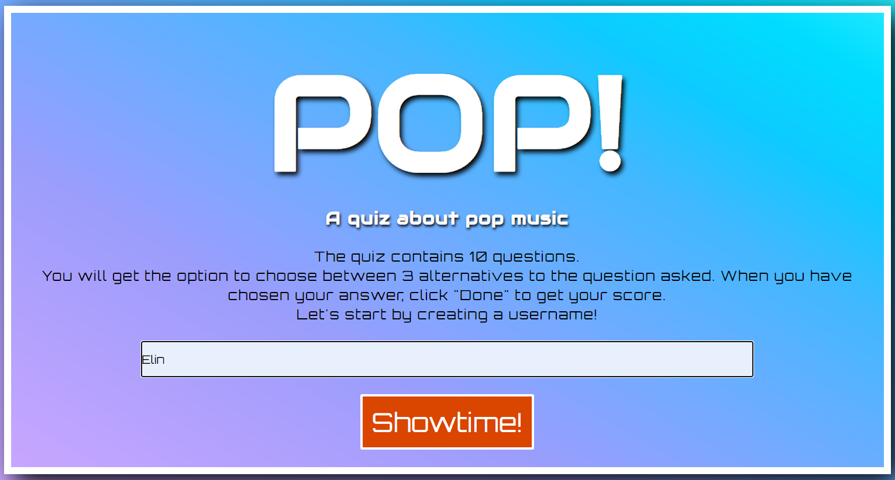

#### Start Button for the quiz to show 
This feature makes sure that the user can start the quiz whenever they are ready. The quiz's first question will not display until the user clicks on the button.
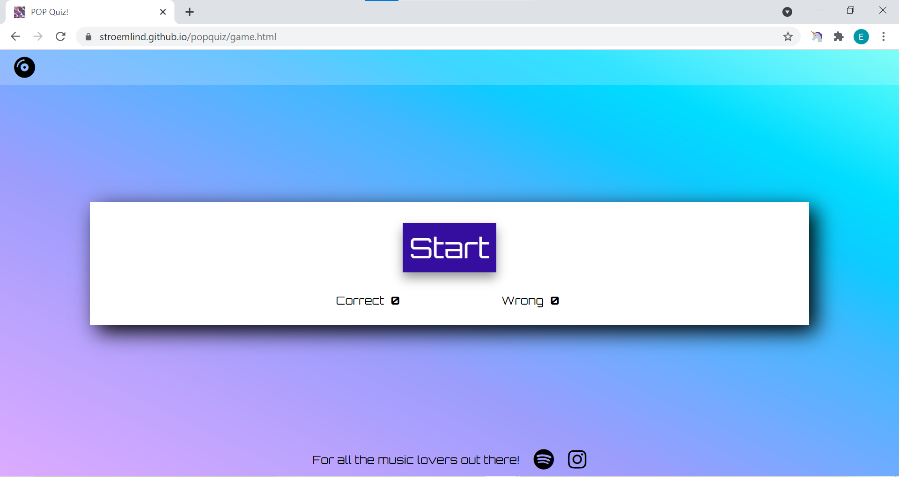

#### Question Section with options 
For every question, the user will get three options to choose from, and one of these is the correct one. The quiz requires the user to select an answer before moving on to the next question.

#### Score Tracking 
When a user submits an answer, they can keep track of their score and if the answers they submitted are correct or wrong. For each answer, they will get one point. The code doesn't show which answers are correct if the user would like to retake the quiz. 

#### Result Section 
Upon finishing the quiz, the user will receive a message with their chosen username on the quiz board, letting them know how many correct answers they got on the quiz game.

#### Button to reset the game 
This button, when clicked, will reset the quiz for the user and take them to the start of the quiz game.

 
#### Social Media icons in the footer
The Social Media icons will take the user to the directed site and application, in this case, Instagram and a Spotify playlist when clicked.
* Footer Icons: Spotify and Instagram

### Features Left to Implement
* A scoreboard to show players with the highest score of the quiz. 
* The user would get the option to choose the degree of difficulty of the quiz, like easy, medium, pro.

## Technologies Used
These are the following technologies used to develop this project: 
* HTML: HTML5 are used to build the core structure of the website
* CSS: CSS is used to style the website with colors, fonts, placement of elements, etc.
* JavaScript: JavaScript are used to make the website more interactive for the user
* Canva: Canva is a web application used to create the wireframes for this project
* Gitpod: Gitpod is the development environment used for developing all the code during this project
* GitHub: GitHub are used to store the repository for this project and GitHub pages to deploy the website
* Git: Git is used to create backups of the project and ensure that all versions of the project is pushed to GitHub 
* DevTools: Dev Tools is used to look over the development of the website, debugging problems, and try different approaches to issues that would occur during the process. 
* Auto Prefixer: Auto Prefixer is an application used at the end of the project to give the CSS code some extra properties when used on different browsers.

## Testing
For testing, there was always a tab open with the website preview through Gitpod port 8000. To check up on my code and see if it worked as I wanted. 
I used DevTools to see how the code would respond if I added or changed properties or values with CSS. I also took help from DevTools to check the responsiveness when decreasing or increasing the screen size. Another tool used during development and testing was Unicorn Revealer, which helped me see if any content was outside its container.
To see and test the website's performance, I used Lighthouse, which gave me an updated report to see how well my accessibility was for the website. The last test results were these:
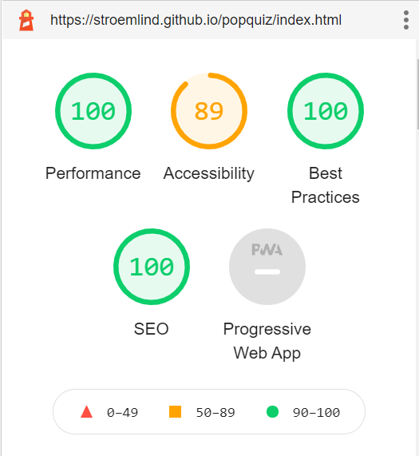

While developing the javaScript code, I used the console section of DevTools to see console.logs in the code if errors occurred with reading the code and debugging the issues. 
The console.logs in the code helped me understand more about the process of debugging problems that occurred and understand how to develop the code.
I used the devTools application section to test if the code for localStorage worked as it should.

### Code Validation
* HTML
I am aware of the warnings for the game.html about the <label>'s as hidden. That is only until the game starts when the start button is getting called.
 * Link to the offical [W3C Validatior](https://validator.w3.org/nu/?doc=https%3A%2F%2Fstroemlind.github.io%2Fpopquiz%2Findex.html) for the index.html 
    

 * Link to offical [W3C Validatior](https://validator.w3.org/nu/?doc=https://stroemlind.github.io/popquiz/game.html) for the game.html
    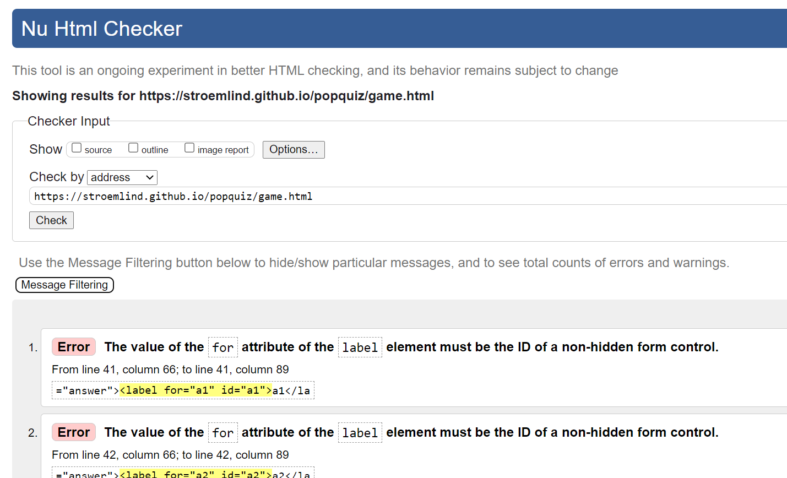

* CSS
There are no errors form the offical [Jigsaw validator](https://jigsaw.w3.org/css-validator/validator?uri=https%3A%2F%2Fstroemlind.github.io%2Fpopquiz&profile=css3svg&usermedium=all&warning=1&vextwarning=&lang=en)
    

* JavaScript
No errors where found when going through the offical [Jshint validator](https://jshint.com/). I am aware of the eight warnings about functions declerations in block. 
 * There are 10 functions in this file
 * Function with the largest signature take 1 arguments, while the median is 0
 * Largest function has 16 statements in it, while the median is 3
 * The most complex function has a cyclomatic complexity value of 5 while the median is 1

    
    

### Browser Compatibility
* Google Chrome
    * The website runs without any issues in the Google Chrome browser. 
    

* Mozilla Firefox 
    * The website runs without any issues in the Mozilla Firefox browser.
    

* Microsoft Edge
    * The website runs without any issues in the Microsoft Edge browser
    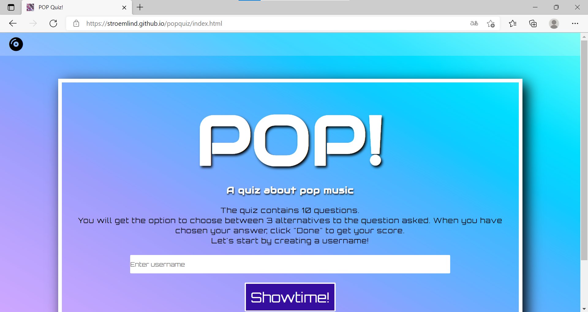

### Responsiveness
The responsiveness for the website works accordingly throughout the whole quiz game process. See pictures below for every step taken.

* Desktop 

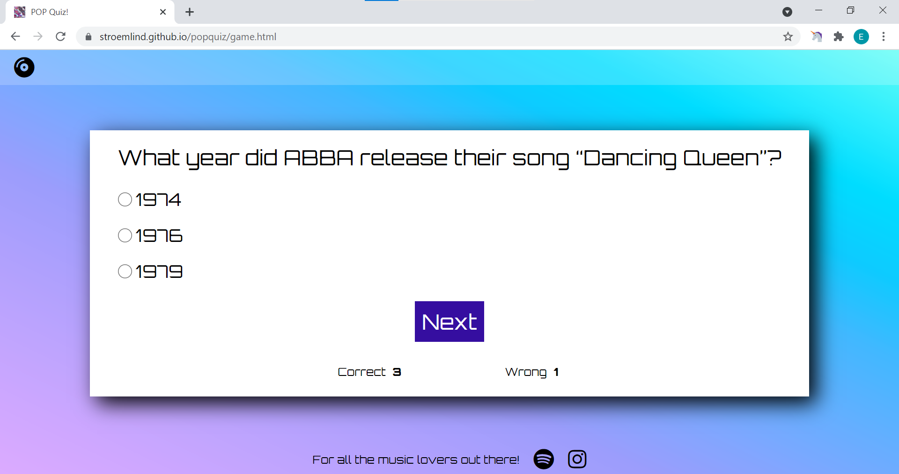
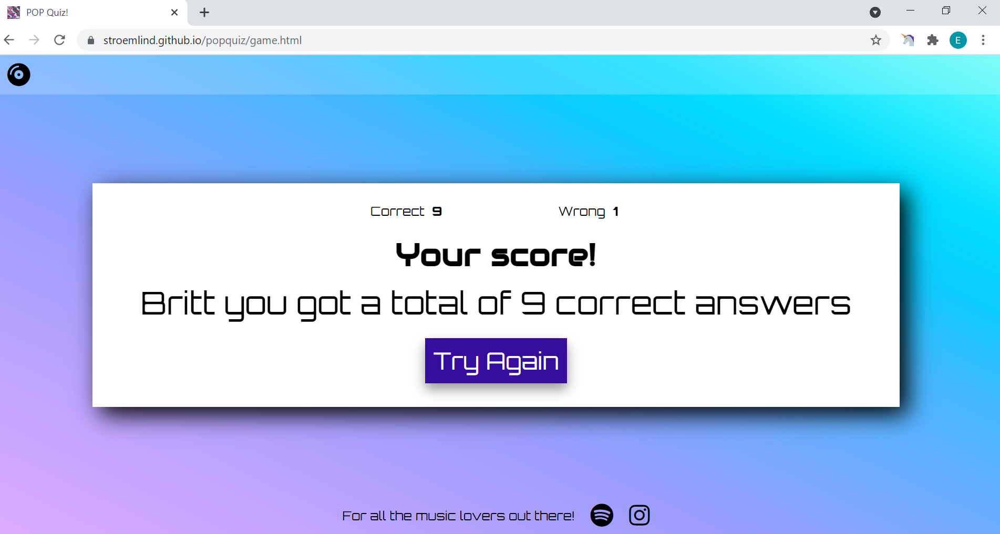

* Tablet 

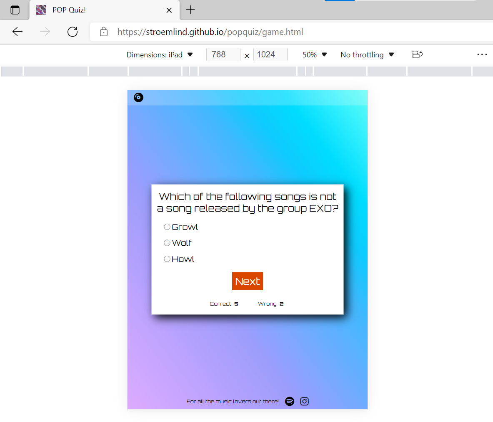

* Mobile 
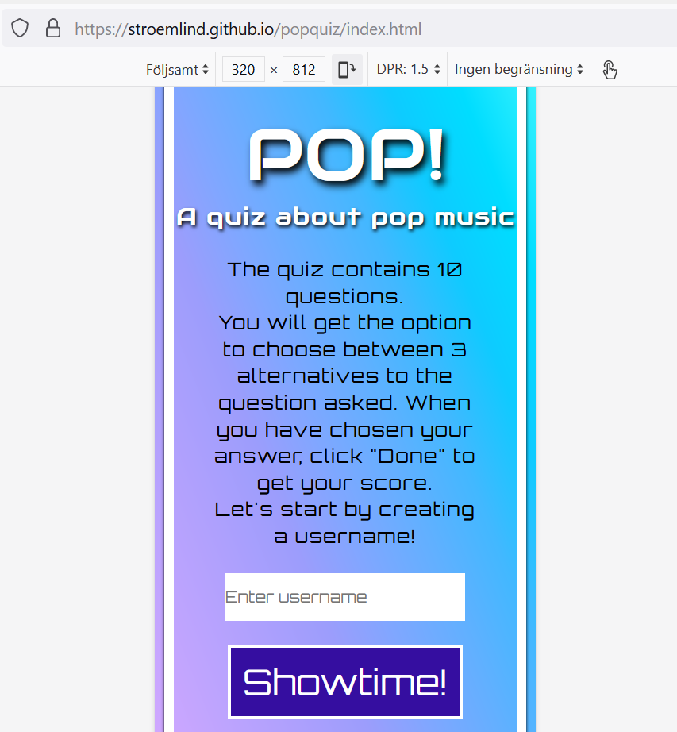
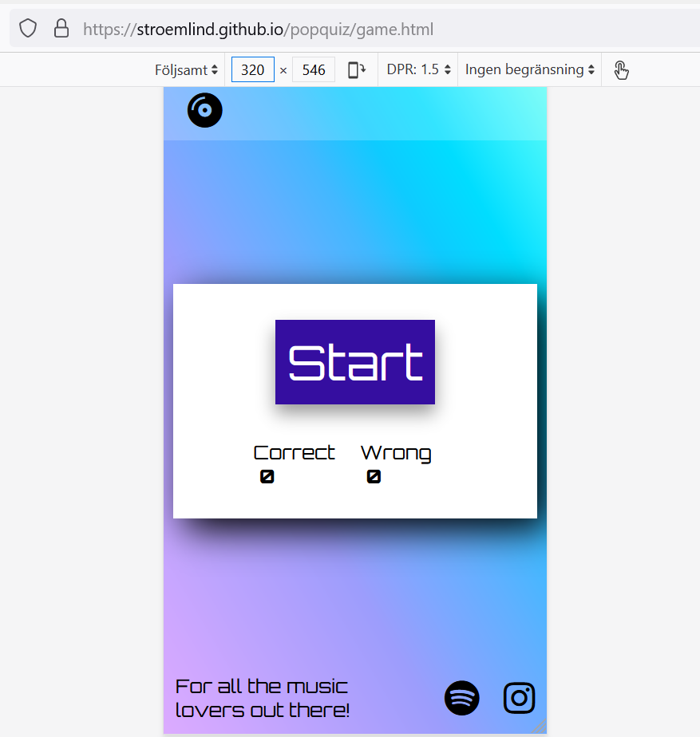
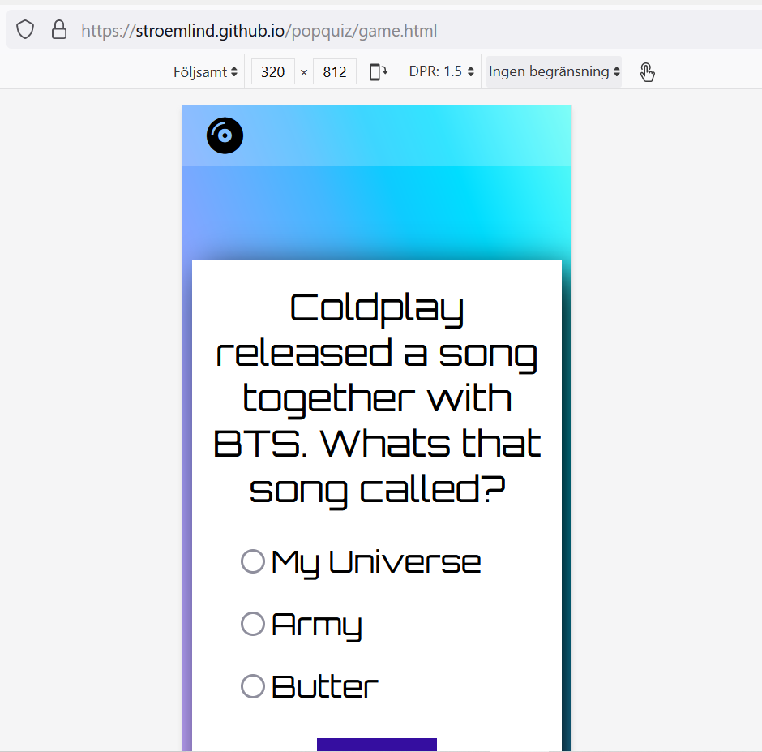

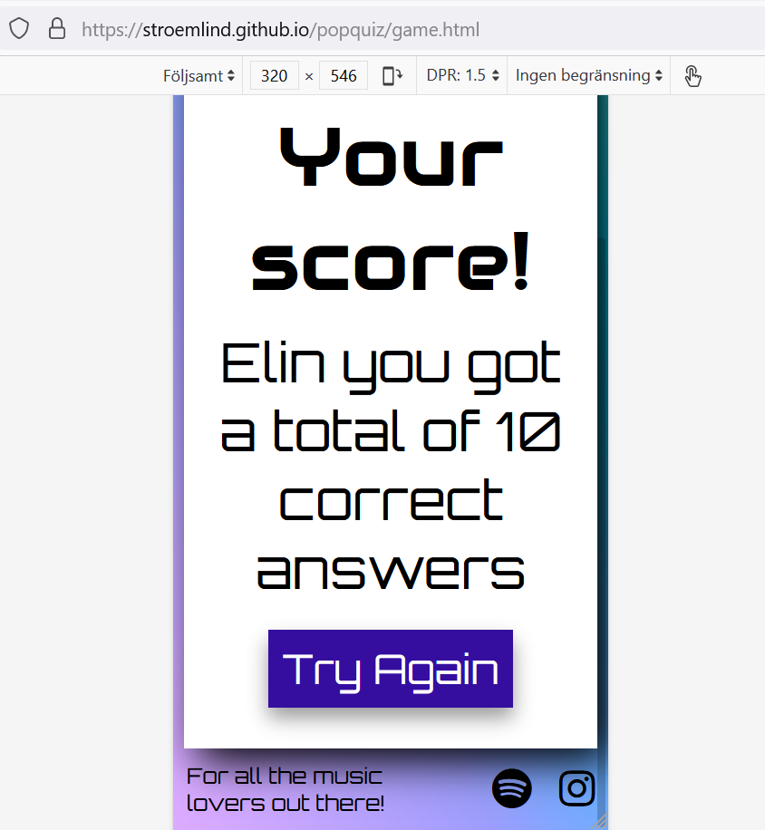

### Tested User Stories
#### Create a username
The user has to submit a username before they can begin the game. If they do not, an alert will notify them to pass in a username, and the "Showtime!" button will not execute the following functions.

#### Scoretracking system
After each submitted question, the Score Tracking system will increment a point to either the correct or wrong element, letting the user know right away if they answered a question correctly or not.

#### Get feedback about the result after the quiz is done
When the last question is submitted, the user's username and the total of correct answers show in the result section. The user can see how many of the questions were correct and incorrect answered.
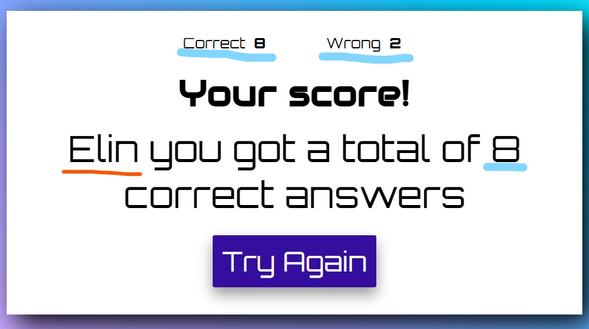

#### Relevent Social Media Icons
When a user clicks on the Social Media Icons in the footer, the link related to the footer opens in a new tab.

* Spotify 

* Instagram
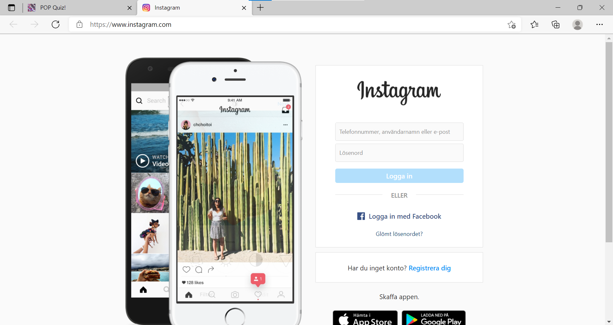

### Unfixed Bugs

## Deployment
The site was deployed to GitHub pages. The steps to deploy are as follows:

- In the GitHub [repository](https://github.com/stroemlind/popquiz), navigate to the Settings tab.
- From the source section drop-down menu, select the `Main` Branch.
- Once the Main branch has been selected and saved, the page will be automatically refreshed with a detailed ribbon displayed to indicate the successful deployment.

The live link can be found here - https://stroemlind.github.io/popquiz

### Local Deployment
In order to make a local copy of this project, you can type the following into your IDE Terminal to clone this repository:

- `git clone https://github.com/stroemlind/popquiz.git`

Alternatively, if using Gitpod, you can [click here](https://gitpod.io/#https://github.com/stroemlind/popquiz), and it will create a brand new workspace on your own Gitpod account.

## Credits
### Content
* [Canva](https://www.canva.com/) werevused to make the wireframe for this project
* The fonts for the website are taken from [Google-fonts](https://fonts.google.com/)
* The icons in the footer are taken from [Fontawesome](https://fontawesome.com/)
* [Autoprefixer](https://autoprefixer.github.io/) were used for the css code
* The [ColoSpace](https://mycolor.space/) were used to find the colors of the Websites
* The Color pallette is created from [Coloor](https://coolors.co/dcabff-8299fa-5ffdf5-da4500-350ea0)
* [This](https://kiranworkspace.com/how-to-stick-footer-to-bottom-of-page/) article give information about how to stick the footer to the bottom of the page when the content isn't enough to fill the whole page
* [This]( https://developer.mozilla.org/en-US/docs/Web/API/Location/reload) article gives information about the reset game function 
* For getting started with the game/quiz functions these sources supply information:
    * [YouTube-video](https://www.youtube.com/watch?v=riDzcEQbX6k)
    * [Sitepoint](https://www.sitepoint.com/simple-javascript-quiz/)
    * [Simplestepscode](https://simplestepscode.com/javascript-quiz-tutorial/)
* The information about localStorage was given by Tim Nelson and through his youtube clip [Wes Bos](https://www.youtube.com/watch?v=YL1F4dCUlLc)

#### Questions
* [EXO](https://en.wikipedia.org/wiki/Exo) / [Spotify](https://open.spotify.com/artist/3cjEqqelV9zb4BYE3qDQ4O?si=5djMFLjESiuD3W4UIQ7XXw)
* [Max Martin](https://en.wikipedia.org/wiki/Max_Martin) 
* [ABBA](https://en.wikipedia.org/wiki/ABBA) / [Spotify](https://open.spotify.com/album/1V6a99EbTTIegOhWoPxYI9?si=Sy4VwdENQ5qYvwsrbuBGUQ)
* [Prince](https://en.wikipedia.org/wiki/Prince_(musician)) / [Spotify](https://open.spotify.com/album/7nXJ5k4XgRj5OLg9m8V3zc?si=7zNRVKVcQfqRl0wklmD38g)
* [Harry Styles](https://en.wikipedia.org/wiki/Harry_Styles)
* [Zara Larsson](https://en.wikipedia.org/wiki/Zara_Larsson) / [Spotify](https://open.spotify.com/album/1hUiGzO4mIUZ0yfV8XHl6Y?si=YYo6EMRhRYeOOlPDsEgWdA)
* [A-HA](https://en.wikipedia.org/wiki/A-ha)
* [Coldplay](https://en.wikipedia.org/wiki/Coldplay) / [Spotify](https://open.spotify.com/album/39McjovZ3M6n5SFtNmWTdp?si=miQk06OYQA65Nv7NFVCHTQ)
* [Camila Cabello](https://en.wikipedia.org/wiki/Camila_Cabello)
* [Backstreet Boys](https://en.wikipedia.org/wiki/Backstreet_Boys)
* [NSYNC](https://en.wikipedia.org/wiki/NSYNC) / [Spotify](https://open.spotify.com/album/5hMd4vAfSUT1cbYCnRUako?si=Qs84n_7RTOiwQsROLQ34xw)
* [Rihanna](https://en.wikipedia.org/wiki/Rihanna) / [Spotify](https://open.spotify.com/album/3JSWZWeTHF4HDGt5Eozdy7?si=6Jrv9NMLRrGCGkF8BaFbtg)
* [Michael Jackson](https://en.wikipedia.org/wiki/Michael_Jackson) / [Spotify](https://open.spotify.com/album/1C2h7mLntPSeVYciMRTF4a?si=HPH7kKe1R3Crnxzv0rniWw)
* [Bruno Mars](https://en.wikipedia.org/wiki/Bruno_Mars)
* [Dua Lipa](https://en.wikipedia.org/wiki/Dua_Lipa)
* [Lil Nas X](https://en.wikipedia.org/wiki/Lil_Nas_X) / [Spotify](https://open.spotify.com/album/4IRiXE5NROxknUSAUSjMoO?si=leDoY2FjQOmqajXisHqhQA)

### Media
* The Favicons source is [Pexels](https://www.pexels.com/sv-se/foto/teknologi-musik-fargrik-rund-4734716/)

### Acknowledgements
I want to give acknowledgments to my mentor Tim Nelson and my friend Johan. They have helped me a lot and provided extraordinary support during this project. 
Tim has been a great mentor and support. I want to acknowledge that he helped me with the if-else statement for which functions and statements should run depending on which page the user is on. He gave me the information about localStorage and how to implement it in my code. Tim also helped me rewrite the code for the pickQuestion and checkAnswer functions from line 56 to 112 in the script.js file when significant bugs occurred. 
My friend Johan helped me at the beginning of the development process with support and feedback on my code. 
I want to give credit and acknoledgment to everyone who tooke their time help me from the Slack Community. 