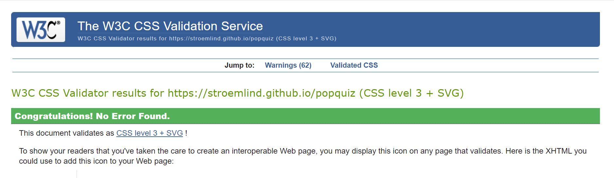

# Testing
For testing, there was always a tab open with the website preview through Gitpod port 8000. To check up on my code and see if it worked as I wanted. 
I used DevTools to see how the code would respond if I added or changed properties or values with CSS. I also took help from DevTools to check the responsiveness when decreasing or increasing the screen size. Another tool used during development and testing was Unicorn Revealer, which helped me see if any content was outside its container.
To see and test the website's performance, I used Lighthouse, which gave me an updated report to see how well my accessibility was for the website. The last test results were these:

While developing the javaScript code, I used the console section of DevTools to see console.logs in the code if errors occurred with reading the code and debugging the issues. 
The console.logs in the code helped me understand more about the process of debugging problems that occurred and understand how to develop the code.
I used the devTools application section to test if the code for localStorage worked as it should.

Several internet browsers, like Chrome, Mozilla Firefox, Microsoft Edge, and Safari, were used during all the testing. It works on all the mentioned internet browsers as well as on mobile devices as well.

### Code Validation
* HTML
I am aware of the warnings for the game.html about the <label>'s as hidden. That is only until the game starts when the start button is getting called.
 * Link to the offical [W3C Validatior](https://validator.w3.org/nu/?doc=https%3A%2F%2Fstroemlind.github.io%2Fpopquiz%2Findex.html) for the index.html 
    

 * Link to offical [W3C Validatior](https://validator.w3.org/nu/?doc=https://stroemlind.github.io/popquiz/game.html) for the game.html
    

* CSS
There are no errors form the offical [Jigsaw validator](https://jigsaw.w3.org/css-validator/validator?uri=https%3A%2F%2Fstroemlind.github.io%2Fpopquiz&profile=css3svg&usermedium=all&warning=1&vextwarning=&lang=en)
    

* JavaScript
No errors where found when going through the offical [Jshint validator](https://jshint.com/). I am aware of the eight warnings about functions declerations in block. 
 * There are 10 functions in this file.
 * Function with the largest signature take 1 arguments, while the median is 0.
 * Largest function has 18 statements in it, while the median is 3.
 * The most complex function has a cyclomatic complexity value of 5 while the median is 1.

    
    

### Browser Compatibility
* Google Chrome
    * The website runs without any issues in the Google Chrome browser 
    

* Mozilla Firefox 
    * The website runs without any issues in the Mozilla Firefox browser
    

* Microsoft Edge
    * The website runs without any issues in the Microsoft Edge browser
    

* Safari 
    * The website runs without any issues in the Safari browser
    

### Responsiveness
The responsiveness for the website works accordingly throughout the whole quiz game process. See pictures below for every step taken.

* Desktop 

* Tablet 

* Mobile 

### Tested User Stories
#### Create a username
The user has to submit a username before they can begin the game. If they do not, an alert will notify them to pass in a username, and the "Showtime!" button will not execute the following functions.

#### Scoretracking system
After each submitted question, the Score Tracking system will increment a point to either the correct or wrong element, letting the user know right away if they answered a question correctly or not.

#### Get feedback about the result after the quiz is done
When the last question is submitted, the user's username and the total of correct answers show in the result section. The user can see how many of the questions were correct and incorrect answered.

#### Relevent Social Media Icons
When a user clicks on the Social Media Icons in the footer, the link related to the footer opens in a new tab.

* Spotify 

* Instagram

### Unfixed Bugs
During testing, the website did not work as expected in the Safari browser or on mobile devices. The only way I could figure out how to solve this issue was to rewrite some of the javaScript code in the script.js file.
I had to put the variables directly in the function and get them by element Id and, in some cases, add the assigned classList to them. 
During the debugging process to solve the issues, I found out that I could remove some of the variables that the code needed in the first place. 

I am aware that the code can be improved to work better with different internet browsers. When playing the quiz, the start section sometimes loads slower, which leads to the user seeing the browser hiding some of the elements, like the answer buttons. It is not that noticeable but, they can see something loading on the page before the start button appears.